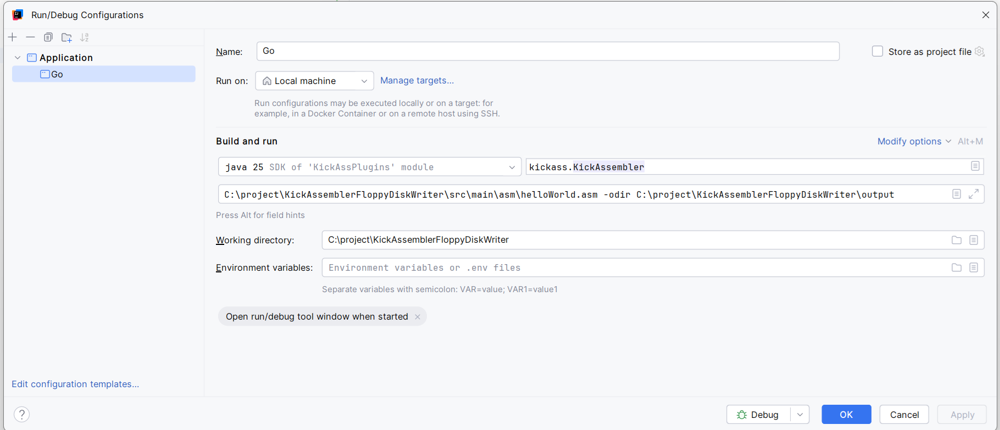

# Setting up the project on Windows 11
This project uses Apache Maven for its build and should be able to be opened in any IDE that support Apache Maven.
This is how I configured my workstation develop this project.  

## What I use
1. Intellij Idea
2. Java SDK 25
3. Kick Assembler 2.5 (Included here.. but not for much longer)  
   This project will **NOT** distribute Kick Assembler once this code is production ready.  
   It's just very convenient to have it in the project at the moment.

# How to run in Intellij IDEA
1. Start a new project, clone from this repo to c:\project
2. Go to Edit Configurations
3. Click + Application
4. Set the name to Go
5. kickass.KickAssembler
6. C:\project\KickAssemblerFloppyDiskWriter\src\main\asm\helloWorld.asm -odir C:\project\KickAssemblerFloppyDiskWriter\output
7. C:\project\KickAssemblerFloppyDiskWriter
   (Of course change these to the directory you are using)

Screenshot of the application configuration

# How it works
Running the project will store the created test disk files in the output directory.

